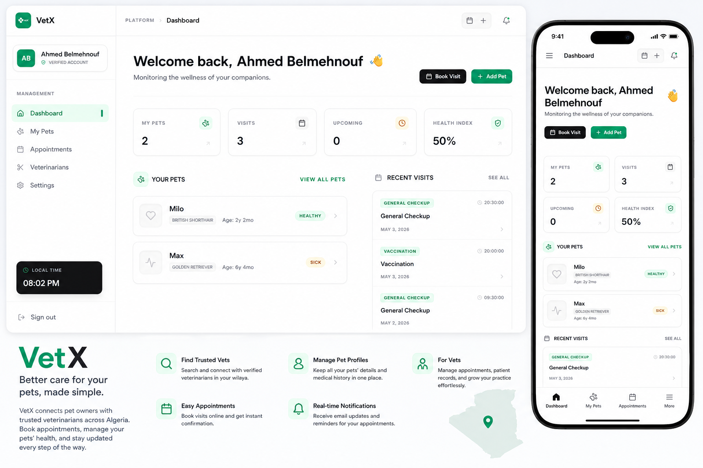
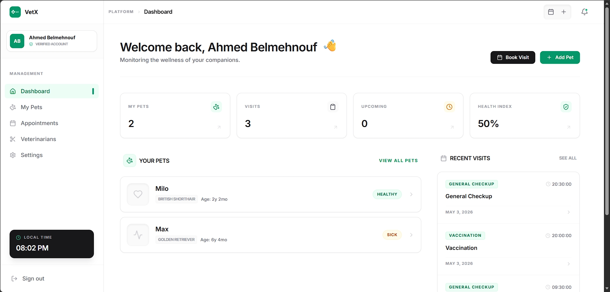
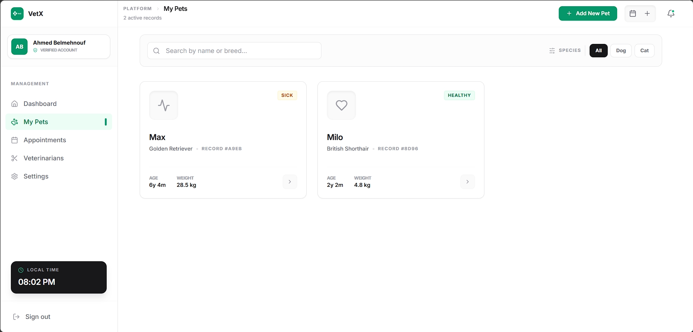
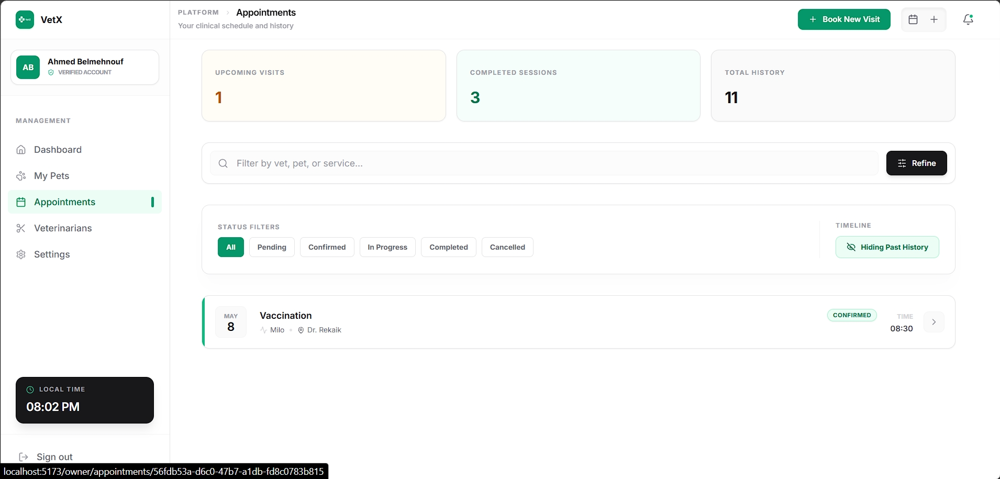
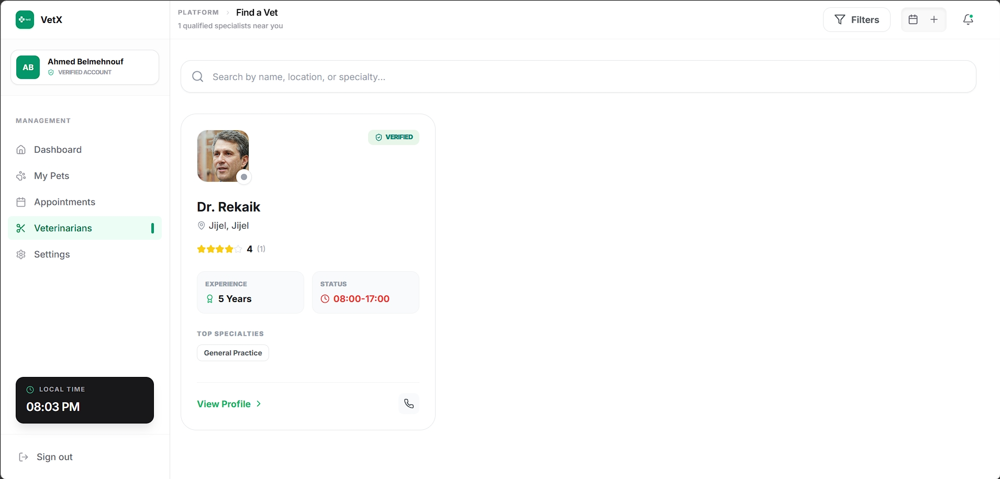
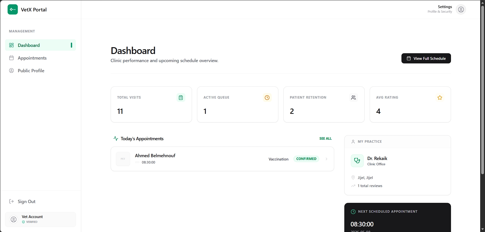
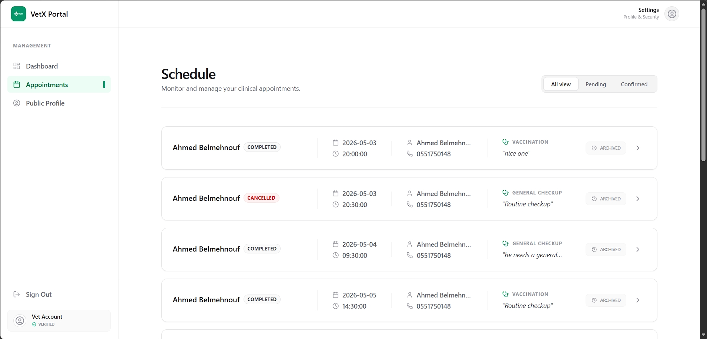
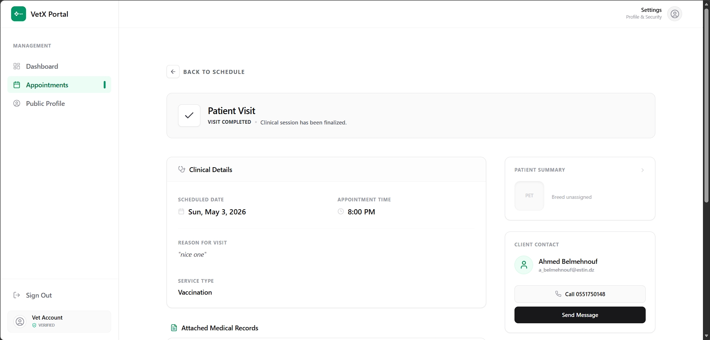
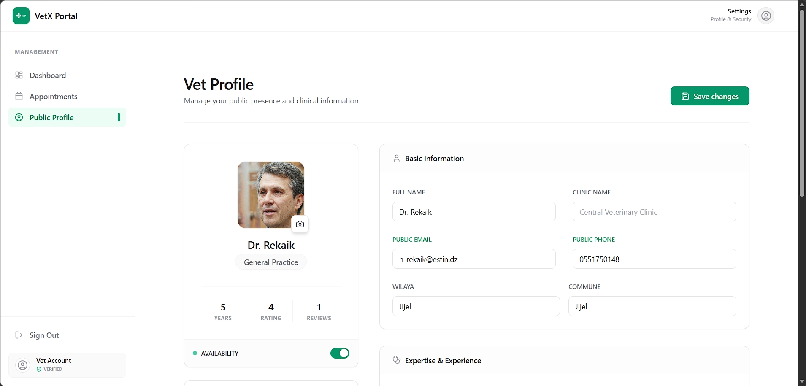
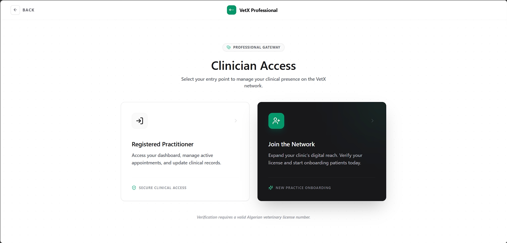

# VetX



## Problem Statement

Pet owners in Algeria struggle to find reliable veterinary services for their animals. The traditional process of finding a veterinarian involves:
- Manual searching through directories or word-of-mouth recommendations
- Difficulty verifying veterinarian credentials and specializations
- No centralized system to book appointments
- Lack of visibility into veterinarian availability
- No digital record-keeping for pet medical history
- Communication gaps between pet owners and veterinarians

Similarly, veterinarians lack a digital platform to:
- Showcase their services and expertise
- Manage appointments efficiently
- Maintain digital medical records
- Communicate with pet owners effectively

## Solution

VetX is a comprehensive web platform that bridges the gap between pet owners and veterinarians in Algeria. The platform provides:

- **For Pet Owners**: A user-friendly interface to search veterinarians by wilaya, book appointments, manage pet profiles, and track medical records
- **For Veterinarians**: A professional dashboard to manage appointments, maintain patient records, and grow their practice
- **Automated Email Notifications**: Powered by **0utmail API** for real-time appointment updates
- **Dual Authentication System**: Separate login flows for pet owners and veterinarians with database validation

## Technology Stack

### Frontend
- **Framework**: React 19 (via Vite)
- **Language**: JavaScript (ESM, ECMA 2020+)
- **Routing**: React Router v7 (`react-router-dom`)
- **Styling**: Tailwind CSS + PostCSS
- **Component Library**: shadcn/ui (configured with `new-york` style, JS variants, using CSS variables)
- **Icons**: `lucide-react` and `react-icons`
- **Code Editor**: Monaco Editor (`@monaco-editor/react`)

### Backend & Services
- **Backend**: Supabase (`@supabase/supabase-js`)
  - Authentication
  - PostgreSQL Database
  - Real-time subscriptions
- **Email Service**: **0utmail API** (`api0utmail-test-email.vercel.app`)
  - Google OAuth integration for Gmail sending
  - HTML email templates
  - Automated notifications

### Development Tools
- **Linting**: ESLint (React & React Hooks rules)
- **Build Tool**: Vite
- **Package Manager**: npm

## Features

### For Pet Owners

#### 1. Authentication & Profile Management
- Sign up with email, password, phone number, wilaya, and commune
- Secure login with credential verification against `utilisateurs` table
- Profile management with personal information

#### 2. Pet Management
- Add and manage multiple pet profiles
- Store pet details: name, species, breed, age, weight, image
- View pet medical history
- Attach medical records (PDF uploads)

#### 3. Veterinarian Search
- Search veterinarians by wilaya (Algerian provinces)
- Filter by specialization and clinic
- View veterinarian profiles with ratings and reviews
- Interactive Algeria map for location-based search

#### 4. Appointment Booking
- Book appointments with preferred veterinarians
- Select service type (consultation, vaccination, surgery, etc.)
- Choose date and time slots
- Add notes/reason for visit
- Attach medical records to appointment requests

#### 5. Appointment Management
- View all appointments with status tracking
- Cancel appointments (sends email notification to veterinarian)
- Rate and review completed appointments
- View appointment details and history

#### 6. Email Notifications
- Confirmation email upon successful booking
- Email when veterinarian confirms appointment
- Email when veterinarian declines appointment
- Cancellation notifications

---

### For Veterinarians

#### 1. Registration & Verification
- Register with professional details (license number, specialization, clinic name)
- Admin approval workflow
- Secure login with credential verification against `vet_accounts` table
- Account status management (active/suspended)

#### 2. Dashboard
- Overview of pending, confirmed, and completed appointments
- Quick stats and metrics
- Today's schedule view

#### 3. Appointment Management
- View all appointments (pending, confirmed, completed, cancelled)
- Confirm appointment requests (sends confirmation email to owner)
- Decline appointments with reason (sends decline email to owner)
- Cancel appointments (sends cancellation email to owner)
- Mark appointments as "In Progress" or "Completed"
- Add clinical notes and observations

#### 4. Patient Records
- View pet medical history
- Access attached medical records (PDF)
- Maintain digital patient files

#### 5. Profile Management
- Update professional information
- Manage services offered
- Set availability

#### 6. Email Notifications
- Notification when new appointment is booked
- Notification when owner cancels appointment

---

## Architecture

### Project Structure

```
vetSi/
├── public/
│   └── logo.png                 # VetX logo
├── src/
│   ├── components/
│   │   ├── ui/                  # shadcn/ui components (do not modify)
│   │   ├── Owner/              # Owner-specific components
│   │   │   ├── Navbar.jsx
│   │   │   ├── Sidebar.jsx
│   │   │   └── OwnerLayout.jsx
│   │   └── vet/                # Vet-specific components
│   │       ├── Navbar.jsx
│   │       ├── Sidebar.jsx
│   │       └── Layout.jsx
│   ├── pages/
│   │   ├── owner/               # Owner pages
│   │   │   ├── Home.jsx
│   │   │   ├── Pets.jsx
│   │   │   ├── PetsAdd.jsx
│   │   │   ├── PetsView.jsx
│   │   │   ├── Vets.jsx
│   │   │   ├── VetView.jsx
│   │   │   ├── Appointments.jsx
│   │   │   └── AppointmentView.jsx
│   │   ├── vet/                 # Vet pages
│   │   │   ├── Form.jsx         # Registration form
│   │   │   ├── Login.jsx
│   │   │   ├── DashboardHome.jsx
│   │   │   ├── Appointments.jsx
│   │   │   ├── AppointmentView.jsx
│   │   │   └── Profile.jsx
│   │   ├── Login.jsx            # Owner login/signup
│   │   ├── Home.jsx
│   │   └── Vets.jsx
│   ├── lib/
│   │   ├── supabase.js          # Supabase client & constants
│   │   ├── email.js             # Email service (0utmail API)
│   │   └── [SQL files]         # Database migrations
│   ├── App.jsx                  # Main routing
│   └── main.jsx                 # Entry point
├── pages/
│   └── api/
│       └── send-email.js        # Vercel serverless API (alternative)
├── screenshots/
│   ├── owner/                   # Owner interface screenshots
│   └── vet/                     # Vet interface screenshots
├── vercel.json                   # Vercel deployment config
└── README.md
```

### Database Schema

#### Tables
- **`utilisateurs`** - Pet owner profiles
  - `id` (UUID, references auth.users)
  - `email`, `full_name`, `phone`
  - `wilaya_code`, `wilaya_name`, `commune`
  - `role`, `created_at`

- **`vet_accounts`** - Veterinarian profiles
  - `id` (UUID, references auth.users)
  - `full_name`, `email`, `phone`
  - `license_number`, `specialization`
  - `clinic_name`, `wilaya`, `status`
  - `created_at`, `updated_at`

- **`pets`** - Pet profiles
  - `id`, `owner_id` (references utilisateurs)
  - `name`, `species`, `breed`, `age`, `weight`
  - `image_url`, `created_at`

- **`appointments`** - Appointment records
  - `id`, `owner_id`, `vet_id`, `pet_id`
  - `service_type`, `scheduled_date`, `scheduled_time`
  - `status` (pending/confirmed/in progress/completed/cancelled/no show)
  - `reason`, `notes`
  - `owner_rating`, `owner_review`
  - `medical_history` (JSONB)
  - `created_at`, `updated_at`

- **`medical_records`** - Medical records
- **`cliniques`** - Clinic information
- **`interactions`** - User interactions

### Authentication Flow

```
Owner Login (/login)              Vet Login (/vet/login)
        │                                │
        ▼                                ▼
Supabase Auth.signInWithPassword    Supabase Auth.signInWithPassword
        │                                │
        ▼                                ▼
Verify user exists in:             Verify vet exists in:
`utilisateurs` table               `vet_accounts` table
        │                                │
        ▼                                ▼
  Redirect to                      Check account status
  /owner                          (active/suspended)
        │                                │
        │                                ▼
        │                          Redirect to /vet/dashboard
        │
        ▼
```

### Email Notification System

```
                        0utmail API
                     (api0utmail-test-email.vercel.app)
                              │
        ┌─────────────────────┼─────────────────────┐
        │                     │                     │
        ▼                     ▼                     ▼
sendAppointmentEmails    sendVetConfirmationEmail   sendVetDeclineEmail
(Owner + Vet)           (Owner only)               (Owner only)
        │                     │                     │
        └──────────┬──────────┴──────────┬────────┘
                   │                     │
                   ▼                     ▼
          sendOwnerCancelEmail     (Future: Reminders)
          (Vet only)
```

Email functions in `src/lib/email.js`:
- `sendAppointmentEmails()` - Sent when owner books appointment
- `sendVetConfirmationEmail()` - Sent when vet confirms
- `sendVetDeclineEmail()` - Sent when vet declines
- `sendOwnerCancelEmail()` - Sent when owner cancels
- `sendVetAcceptanceEmail()` - Sent when admin approves vet registration
- `sendVetRefusalEmail()` - Sent when admin rejects vet registration

**Email API Implementation** (`src/lib/email.js`):
```javascript
async function sendEmail(to, subject, html) {
  const res = await fetch("https://api0utmail-test-email.vercel.app/sendHtml", {
    method: "POST",
    headers: { "Content-Type": "application/json" },
    body: JSON.stringify({
      api_key: "key_v24ftfkp3_c8n623",
      google_token: {
        access_token: "ya29.a0ATkoCc4qccPqeYY0345bMDuB4vUSm6u...",
        refresh_token: "1//033xojxmC8bglCgYIARAAGAMSNwF...",
        scope: "https://www.googleapis.com/auth/gmail.send",
        token_type: "Bearer",
        expiry_date: 1772213278139
      },
      to,
      subject,
      html
    })
  });
  return res.json();
}
```

### Routing Architecture

```javascript
/                           → Landing Page (VetXLanding)
/login                      → Owner Login/Signup
/vet/login                  → Veterinarian Login
/vet/register               → Vet Registration Form

// Owner Routes (Protected)
/owner                      → Owner Dashboard
/owner/pets                 → My Pets
/owner/pets/:id              → Pet Details
/owner/pets/add              → Add New Pet
/owner/vets                  → Search Veterinarians
/owner/vets/:id              → Vet Profile
/owner/appointments          → My Appointments
/owner/appointments/:id      → Appointment Details

// Vet Routes (Protected)
/vet/dashboard              → Vet Dashboard
/vet/appointments           → Manage Appointments
/vet/appointments/:id       → Appointment Details
/vet/profile                → Profile Settings
```

## Screenshots

### Owner Interface


*Owner dashboard with quick actions*


*Pet profiles and medical records*


*Appointment booking interface*


*Appointment management and tracking*

---

### Veterinarian Interface


*Veterinarian dashboard with stats and schedule*


*Manage pending and confirmed appointments*


*View appointment details and add clinical notes*


*Access pet medical history and records*


*Profile and clinic information management*

---

## Setup & Installation

1. Clone the repository
2. Install dependencies:
   ```bash
   npm install
   ```

3. Configure environment variables (`.env`):
   ```
   VITE_SUPABASE_URL=your_supabase_url
   VITE_SUPABASE_ANON_KEY=your_supabase_anon_key
   VITE_SUPABASE_SERVICE_ROLE_KEY=your_supabase_service_role_key
   VITE_OUTMAIL_KEY={"key": "your_outmail_api_key"}
   VITE_OUTMAIL_TOKEN_ACCESS=your_outmail_google_token_access
   VITE_OUTMAIL_TOKEN_REFRESH=your_outmail_google_token_refresh
    
   ```

4. Run database migrations in Supabase SQL editor

5. Start development server:
   ```bash
   npm run dev
   ```

6. Build for production:
   ```bash
   npm run build
   ```

## Available Scripts

- `npm run dev` - Start development server (http://localhost:5173)
- `npm run build` - Build for production
- `npm run preview` - Preview production build
- `npm run lint` - Run ESLint

## Email System

The platform uses **0utmail API** for all email communications:

- **API Endpoint**: `https://api0utmail-test-email.vercel.app/sendHtml`
- **Authentication**: API key + Google OAuth tokens
- **Email Types**:
  - Appointment booking confirmations
  - Veterinarian confirmation notifications
  - Veterinarian decline notifications
  - Owner cancellation notifications
  - Veterinarian acceptance/refusal emails

All email templates are styled HTML with responsive design and match the VetX brand identity.

## License

© 2026 VetX — La santé animale simplifiée.
